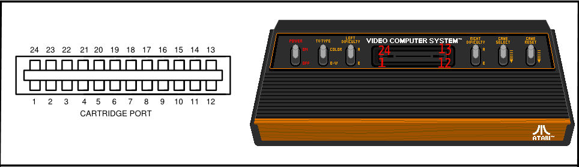

 Wiring
========

Atari Cartridge Slot
--------------------
```
  24 23 22 21 20 19 18 17 16 15 14 13
| == == == == == == == == == == == == |
| == == == == == == == == == == == == |
   1  2  3  4  5  6  7  8  9 10 11 12
```


Pinout Teensy++ 2.0
-------------------
```
     _ _
  1-| v |-40
  2-|   |-39
  3-|   |-38
  4-|   |-37
  5-|   |-36
  6-|   |-35
  7-|   |-34
  8-|   |-33
  9-|   |-32
 10-|   |-31
 11-|   |-30
 12-|   |-29
 13-|   |-28
 14-|   |-27
 15-|   |-26
 16-|   |-25
 17-|   |-24
 18-|   |-23
 19-|   |-22
 20-|___|-21

```

| Atari 2600 Pin | Atari 2600 Name | Teensy++ 2.0 Pin | Teensy++ 2.0 Name |
|----------------|-----------------|------------------|-------------------|
| 24             | SGND            | 1                | GND               |
| -              | -               | 2                | PB7               |
| 22             | A8              | 3                | PD0               |
| 21             | A9              | 4                | PD1               |
| 19             | A10             | 5                | PD2               |
| 20             | A11             | 6                | PD3               |
| 18             | A12             | 7                | PD4               |
| -              | (A13)*          | 8                | PD5               |
| -              | (A14)*          | 9                | PD6               |
| -              | (A15)*          | 10               | PD7               |
| -              | (R/W)*          | 11               | PE0               |
| -              | -               | 12               | PE1               |
| 8              | A0              | 13               | PC0               |
| 7              | A1              | 14               | PC1               |
| 6              | A2              | 15               | PC2               |
| 5              | A3              | 16               | PC3               |
| 4              | A4              | 17               | PC4               |
| 3              | A5              | 18               | PC5               |
| 2              | A6              | 19               | PC6               |
| 1              | A7              | 20               | PC7               |
| 17             | D7              | 21               | PF7               |
| 16             | D6              | 22               | PF6               |
| 15             | D5              | 23               | PF5               |
| 14             | D4              | 24               | PF4               |
| 13             | D3              | 25               | PF3               |
| 11             | D2              | 26               | PF2               |
| 10             | D1              | 27               | PF1               |
| 9              | D0              | 28               | PF0               |
| -              | -               | 29               | AREF              |
| 12             | GND             | 30               | GND               |
| -              | -               | 31               | PE6               |
| -              | -               | 32               | PE7               |
| -              | -               | 33               | PB0               |
| -              | -               | 34               | PB1               |
| -              | -               | 35               | PB2               |
| -              | -               | 36               | PB3               |
| -              | -               | 37               | PB4               |
| -              | -               | 38               | PB5               |
| -              | -               | 39               | PB6               |
| 23             | +5V             | 40               | VCC               |

(* These signals do not exist on the Atari 2600 cartridge slot, but are still handled by
firmware like the would exist. For easier adaptation to other platforms.)
